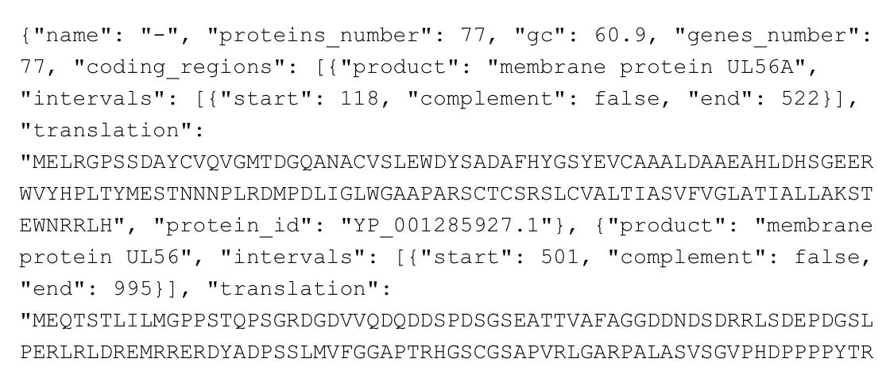
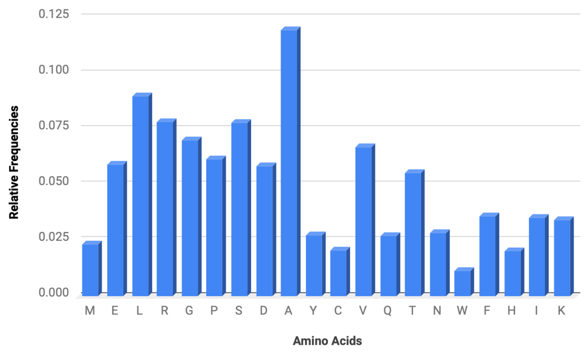
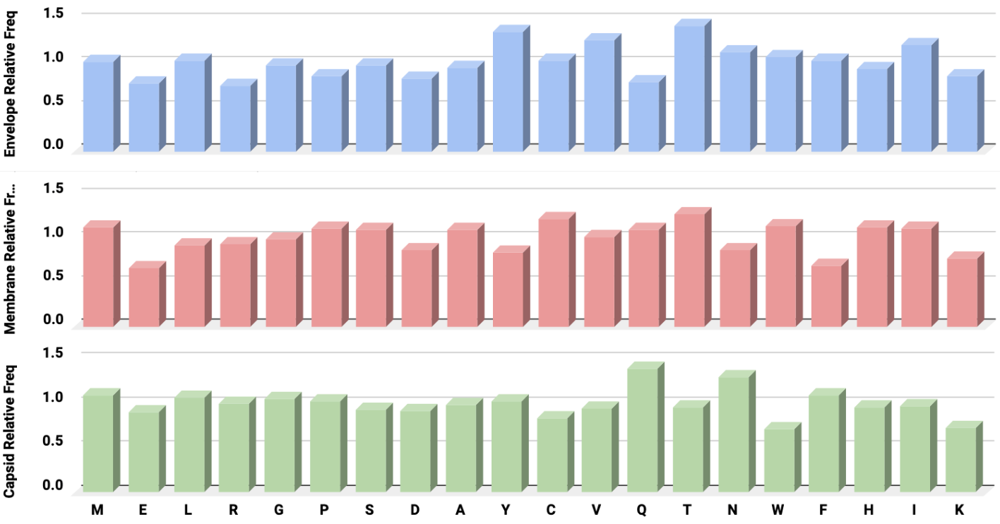
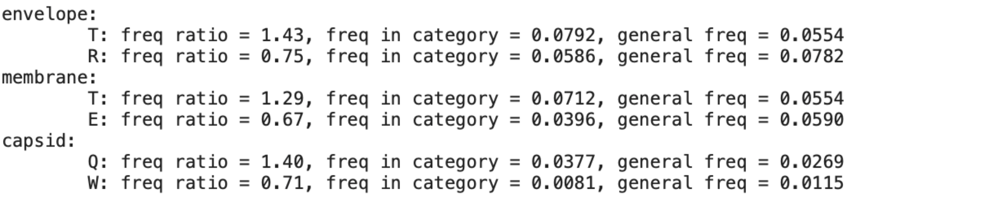

# Decoding The Viral Proteome

Viruses are our planet's most abundant biological entities, consisting largely of genetic material enclosed in a protein coat. However, unlike the cells that viruses prey on, they are incapable of carrying out metabolic processes or self-replication. Instead, they employ a cunning strategy, relying on the very cells they invade to proliferate. By delving into viruses' genetic code, we can unearth their evolutionary lineages, decipher their strategies for eluding their host's immune systems, and even engineer precise weapons in the form of vaccines to shield against their infectious capabilities. This is all made possible through the use of modern bioinformatics techniques. 

In this tutorial, you'll learn how to decode the viral genome and proteome, unraveling intricate genetic blueprints. Additionally, after reading this article, you'll know how to identify the frequencies of amino acids within a viral proteome and find the frequencies of different amino acids within a viral envelope, membrane, and capsid. 

## 🧫 What Is A Proteome? How Does It Differ From A Genome?

A viral genome is a virus's complete genetic material or nucleic acid content. It consists of the specific DNA or RNA sequences that encode all the information necessary for the virus's replication, structural components, and regulation of its life cycle. In other words, the viral genome contains the genetic instructions required for the virus to infect host cells, reproduce, and generate new viral particles.

A viral proteome, on the other hand, refers to the complete set of proteins encoded by a virus's genome. A proteome consists of all the proteins produced by the virus, including structural proteins, such as capsid and envelope proteins, enzymes, and other functional proteins required for the virus's life cycle and replication.

Viral proteomes are much smaller than the proteomes of complex organisms like humans, and their proteomes are adapted to their specific needs. For example, the viral proteome is primarily geared towards facilitating viral replication, infection, and evasion of host immune responses. Additionally, these proteins play a crucial role in the virus's ability to infect host cells and reproduce.

## 🧫 Herpesviruses: Genetics, Structure, and Life Cycle

In this tutorial, we will focus on decoding the herpes virus genome, which is composed of linear, double-stranded DNA. Like many other viruses, the herpes virus is enclosed in a protein coat called a capsid, which encases its DNA. Additionally, the herpes virus has a lipid bilayer membrane, called an envelope, derived from its host cell's membrane, which contains viral glycoproteins.

Herpes viruses can infect a variety of different hosts, including humans. In order to infect their hosts, herpes viruses enter host cells, replicate their DNA, and produce new viral particles. This replication process can lead to latent infections, where the virus hides in host cells and periodically activates to produce new viral particles.

By understanding the structure, genetics, and life cycle of viruses, like the herpes virus, we can better develop antiviral strategies and vaccines. In the code block below, I'll show you how to load a [JSON file containing the herpes viruses genetic information](https://github.com/evanpeikon/viral-proteome/blob/main/data/herpesvirus_genome.json):

```
import json
viral_genome = open('/herpesvirus_genome.json', 'r')
data = json.load(viral_genome)
```
Next, let’s take a look at the partial contents of this JSON file, which contains information about the coding regions in the herpes virus genome and proteins encoded with that sequence:



Now, here's an explanation of the JSON contents:
- This first section of the JSON file provides information about the entire herpes virus genome. The field ```''name'':''-''``` specifies the name of the sequence, which is this case is left blank.
- The field ```''proteins_number'':77``` indicates that there are 77 total proteins encoded within this genome sequence. next, ```''GC'':60.9``` refers to the GC content of the genome sequence, which refers to the proportion of guanine and cytosine nucleotides in the DNA sequence. Then, ```''genes_number'':77``` indicates that there are 77 genes without this genomic sequence, which code for proteins or functional RNA molecules.
- Finally, ```''coding_regions'':``` is an array that contains detailed information about the coding regions within the genome. Each element in the array represents a specific coding region (gene) along with its associated data. In the next code block i’ll provide an example of an element in the coding_regions array:
```
#This specific example above is the first element in the coding_regions array, but there are 77 such examples for each protein encoded by the genome sequence.

[{''product'': ''membrane protein UL56A'', ''intervals'': [{''start'': 118, ''complement'': false, ''end'': 522}], ''translation'': ''MELRGPSSDAY…etc'', ''protein_id'': ''YP_001285927.1''}, 
```
- The ```''coding_regions'': ''membrane protein UL56A''``` field describes the product or function of the encoded protein. In this case, it describes membrane protein UL56A, which is hypothesized to affect vesicular trafficking in infected cells ([Koshizuka et al.](https://github.com/evanpeikon/viral-proteome/blob/main/references.md)).
- Next, the ```''intervals'': [{''start'': 118, ''complement'': false, ''end'': 522}]``` array contains information about the start and end positions of the coding region and whether the sequence is on the complementary strand or not. Then, the ```''translation'': ''MELRGPSSDAY…etc'```', field contains the translated amino acid sequence of the protein encoded by the coding region.
- Finally, we have the ```''protein_id'': ''YP_001285927.1''``` field, which represents the unique identifier for the encoded protein, which can be used to retrieve information about the specific protein from databases or other sources.

## 🧫 Identifying The Frequency Of Each Amino Acid In A Viral Proteome 
Now that we've explored the content of our JSON file containing information about the coding regions in the herpes virus genome, we can start to answer questions, such as "What is the frequency of each amino acid in the herpes virus proteome?" Before showing you how to find this out, I want to provide some background information on why this may be useful.

First, analyzing the frequency of each amino acid in a virus genome provides a comprehensive overview of the protein composition, which is essential for understanding their roles. Additionally, amino acid frequencies can provide clues about the functional characteristics of viral proteins. For example, certain amino acids may be more common in specific protein domains or motifs, and these patterns can help predict protein function. Finally, comparing amino acid frequencies in different viruses allows for taxonomic classification and insights into evolutionary relationships, which is valuable for understanding the relatedness of other viral species.

In the sample code below, I'll show you how to find the frequency of each amino acid in the herpes virus genome:

```
from collections import Counter

def normalize(counter):
  total = sum(counter.values())
  return {key: count/total for key, count in counter.items()}

amino_acid_counter = Counter()

for coding_region in data['coding_regions']:
  amino_acid_counter.update(coding_region['translation'])

amino_acid_frequencies = normalize(amino_acid_counter)
print(amino_acid_frequencies)
```
Now, lets break the code above down one step at a time to better understand how it works:
- This code, ```def normalize(counter):``` defines a function called normalize, which normalizes the counts within a Counter object, making it possible to calculate the relative frequencies of each element in the Counter.
  - Next, ```total=sum(counter.values())``` calculates the total count by summing the values (counts) of all elements (keys) in the Counter object, effectively adding up all of the counts in the counter.
  - Finally, ```return {key: count/total for key, count in counter.items()}``` creates a new dictionary. For each key and count in the Counter object, it calculates the relative frequency by dividing the count of that key by the previously calculated total count. The result is a dictionary where each key is associated with its relative frequency. 
- Then, ```amino_acid_counter = Counter()``` creates an empty Counter object to keep track of the occurrence of each amino acid in all of the coding regions within the herpes virus genome. Then, a for loop is created, which loops through each coding region in our JSON file. For each coding region, the translation is added to the ```amino_acid_counter``` dictionary.
- Finally, the code ```amino_acid_frequencies = normalize(amino_acid_counter)``` is used to normalize the counts in amino_acid_counter, providing the relative frequencies of each amino acid in all of the coding regions. Then, )```print(amino_acid_frequencies))``` prints the normalized frequencies of amino acids in all coding regions. I then took the output of the code above and plotted the data, resulting in the following chart:


(Fig. 1. The frequency of all 20 amino acids in the entire Herpes virus proteome)

In the image above, you can see that arginine (A) is by far the most common amino acid in the herpes virus proteome, which indicates its importance for this virus. Interestingly, research dating back to as easily as the 1960s shows that arginine is essential for the replication of the herpes simplex virus ([Tankersley, 1994](https://github.com/evanpeikon/viral-proteome/blob/main/references.md)). Without arginine, the formation of virions is prevented, whereas the addition of arginine immediately stimulates protein synthesis, which is followed by virus formation ([Beckey et al.,](https://github.com/evanpeikon/viral-proteome/blob/main/references.md)).

## 🧫 Finding The Relative Frequency Of Amino Acids In The Herpesviruses Envelope, Membrane, and Capsid

The herpes virus genome is a single, unified genetic entity containing all of the genetic information needed for the virus to function and replicate. However, different regions of the virus, such as the envelope, membrane, and capsid, may have different amino acid frequencies. By analyzing and comparing the frequencies of amino acids in different regions of the virus, we can better understand their unique functions and elucidate the specific characteristics and roles of proteins associated with viral entry, replication, and structural integrity.

Additionally, understanding the frequencies of amino acids in different regions of a virus can help identify potential drug targets. For example, envelope proteins are often critical for viral entry into host cells. Identifying which amino acids are important for these functions is valuable for vaccine and drug design. In the code below, I’ll show you how to find the relative frequencies of amino acids in the herpes virus membrane, envelope, and capsid:

```
amino_acid_counts_per_category = {'envelope': Counter(), 'membrane': Counter(), 'capsid': Counter()}

for coding_region in data['coding regions']:
  for category, aa_counter in amino_acid_counts_per_category.items():
    if category in coding_region['product'].lower():
      aa_counter.update(coding_region['translation'])

amino_freq_per_category = {}
aa_relative_freq_per_category = {}

for category, aa_counter in amino_acid_counts_per_category.items():
  aa_freq = normalize(aa_counter)
  aa_freq_per_category[category] = aa_freq
  aa_relative_freq = {aa:freq/all_aa_freq[aa] for aa, freq in aa_freq.items()}
  all_relative_freq_category[category] = aa_relative_freq

print(all_relative_freq_per_category)
```
Now, lets break the code above down one step at a time to better understand how it works:
- ```amino_acid_counts_per_category ={…etc.}``` creates three empty Counter objects,  which keep track of amino acid counts for different protein categories, including ‘envelope’, ‘membrane’, and ‘capsid’. A for loop is created, which loops through each coding region in the data (JSON) file. Within this look, the code checks if the coding region’s product description (in lowercase) contains any of the defined category keywords, including ‘envelope’,  ‘membrane’, and ‘capsid’. If it does, the amino acids from that region are counted in the respective category’s Counter.
- Next, the ```aa_freq_per_category``` and ```aa_relative_freq_per_category``` dictionaries are created, which will store the amino acid frequencies and relative amino acid frequencies for each of our three categories (‘envelope’,  ‘membrane’, and ‘capsid’).
- Then, ```for category, aa_counter in aa_counter_per_category.items():``` is used to iterate through the items in the aa_counter_per_category dictionary, where each item represents a category ('envelope', 'membrane', or 'capsid') and the corresponding Counter object (aa_counter) that contains the counts of the amino acids for that category.
  - Following that, ```all_freq=normalize(aa_counter)``` uses the previously defined normalize function to take the Counter(aa_counter) for the current category, calculate the relative frequencies of amino acids within each category, and store those results in the aa_freq dictionary. 
- After calculating the relative frequencies of amino acids in each category, the results are stored in the ```aa_freq_per_category``` dictionary with the code ```aa_freq_per_category[category]=aa_freq```, which stores the category name as a key and the aa_freq dictionary corresponding to that category as the value.
  - Then, the code ```aa_relative_freq={aa: freq/all_aa_freq[aa] for aa, freq in aa_freq.items()}``` calculates the relative amino acid frequencies by dividing the frequency of each amino acid within a given category by the frequency of the same amino acid within the entire herpes virus genome (all_aa_freq). 
- Finally, ```aa_relative_freq_per_category[category] = aa_relative_freq``` stores each category's calculated relative amino acid frequencies in the aa_relative_freq_per_category dictionary. A print statement is then used to print the code output showing the relative frequencies of amino acids within each category and their relationship to the general frequencies. I then took the outputs from said print statement and graphed them in excel, resulting in the following charts:


(Fig. 2. The relative frequencies of all 20 amino acids in the herpes virus envelope, membrane, and capsid.)

The image above shows the relative frequencies of all twenty amino acids in the herpes virus envelope, membrane, and capsid. Whereas arginine is the most common amino acid in the entire herpes virus proteome, its frequency is more modest in envelope, membrane, and capsid. Instead, threonine (T) is the most common amino acid in the herpes virus envelope and membrane, whereas glutamine (Q) is most common in the capsid. Now, the question is why? After some research, I found the following quote in a paper titled, Role of Herpes Simplex Virus 1 Immediate Early Protein ICP22 in Viral Nuclear Egress ([Maruzuru et al.,](https://github.com/evanpeikon/viral-proteome/blob/main/references.md)):
```
“A heterodimeric complex, designated the nuclear egress complex (NEC), between the HSV-1 proteins UL31 and UL34, conserved in all known herpesviruses, is critical for primary envelopment…In addition, an HSV-1 serine/threonine protein kinase, Us3, which has been shown to phosphorylate the NEC, is thought to be involved in primary envelopment because it is able to regulate the localization of UL31 and UL34 at the nuclear membrane and to phosphorylate the nuclear lamina.”
```

In lay terms, this quote says that the nuclear egress complex (NEC) is evolutionarily conserved, meaning it is present in all known herpes viruses. The NEC comprises two different proteins, UL31 and UL34, which come together to form a single functional unit. Additionally, the NEC is called a heterodimeric complex because it is made of two different protein subunits (UL31 and UL34) working together. The quote also says that the NEC is involved in primary envelopment, the initial step in the process by which newly formed herpes virus nucleocapsids (DNA+proteins) exit a cell's nucleus, where they were initially assembled. The process of primary envelopment is essential for the virus to complete its replication cycle and infect new cells. Additionally, the protein kinase Us3 is known to phosphorylate (i.e., add phosphate groups to) the proteins UL31 and UL34, modifying them in a way that is needed to form the primary envelope. Us3 is a serine/threonine kinase, and we can see if it plays a critical role in the herpes virus primary envelopment, which may explain why threonine is the most commonly coded for amino acid in both the envelope and membrane.

Now, what about the capsid? You’ll notice that glutamine (Q) and asparagine (A) are the two most common amino acids in the herpes virus capsid, which protects the nucleic acids from the environment. Interestingly, there is evidence that both glutamine and asparagine play important roles in nucleotide biosynthesis, which may explain their elevated frequency in the herpes virus capsid.

## 🧫 Finding The Amino Acids With The Highest and Lowest Frequencies In Herpesvirus Envelope, Membrane, and Capsid

Amino acids with the highest frequencies in specific viral structural components like the envelope, membrane, and capsid are likely to be functionally crucial. Analyzing these high-frequency amino acids can provide insights into the critical motifs or domains in these proteins. Conversely, low-frequency amino acids may be involved in variable or less critical regions. In the previous section, I showed you how to calculate the relative frequencies of amino acids in different viral structural components, then graphed the relative frequencies to identify which amino acids have the highest and lowest frequencies. In this last section, I'll show you how to automate this process with a few simple lines of code, as demonstrated below:

```
from operator import itemgetter

def get_amino_acid_stats(aa, category):
  return '%s: freq ratio= %.2f, freq in category = %.4f, general freq = %.4f' % (aa, \ aa_relative_frequency_per_category[category][aa], aa_freq_per_category[category][aa], all_aa_freq[aa])

for category, aa_relative_freq in aa_relative_freq_per_category.items():
  max_aa, _ = max(aa_relative_freq.items(), key= itemgetter(1))
  min_aa, _ = min(aa_relative_freq.items(), key= itemgetter(1))
  print('%s:' % category)
  print('\t' + get_aa_states(max_aa, category)
  print('\t' + get_aa_states(min_aa, category)
```
Which produces the following output:


Now, let’s break this code down line by line to understand how it works:
- First, ```from operator import itemgetter``` imports the itemgetter function, which will be used extract the amino acids with the highest and lowest frequencies.
- Then, ```def get_aa_stats(aa, category):``` initiates a function that takes two arguments including ```aa``` (amino acid) and ```category``` (protein category). It then generates a string that summarizes statistics about a specific amino acid in a given category.
- The code then enters a for loop, which iterates over the ```aa_relative_freq_per_category.items():``` dictionary using the protein categories as keys and the ```aa_relative_freq``` dictionary as the corresponding value.
- Finally, ```max_aa, _ = max(aa_relative_freq.items(), key = itemgetter(1))``` identifies the amino acid with the highest relative frequency (max_aa) with a given category, whereas ```min_aa, _ = max(aa_relative_freq.items(), key = itemgetter(1))``` does the opposite.
- 
The code then prints the name of each category, as well as summary statistics including the amino acids with the highest and lowest relative frequencies and how those compare to the background frequencies for those amino acids.

## References 
1. Koshizuka T, Kawaguchi Y, Nishiyama Y. Herpes simplex virus type 2 membrane protein UL56 associates with the kinesin motor protein KIF1A. J Gen Virol. 2005 Mar;86(Pt 3):527-533. doi: 10.1099/vir.0.80633-0. PMID: 15722511.
2. Tankersley R. W. Jun 1964; Amino acid requirements of herpes simplex virus in human cells. J. Bact 87:609
3. Becker Y, Olshevsky U, Levitt J. The role of arginine in the replication of herpes simplex virus. J Gen Virol. 1967 Oct;1(4):471-8. doi: 10.1099/0022-1317-1-4-471. PMID: 4295376.
4. Maruzuru Y, Shindo K, Liu Z, Oyama M, Kozuka-Hata H, Arii J, Kato A, Kawaguchi Y. Role of herpes simplex virus 1 immediate early protein ICP22 in viral nuclear egress. J Virol. 2014 Jul;88(13):7445-54. doi: 10.1128/JVI.01057-14. Epub 2014 Apr 16. PMID: 24741100; PMCID: PMC4054440.
